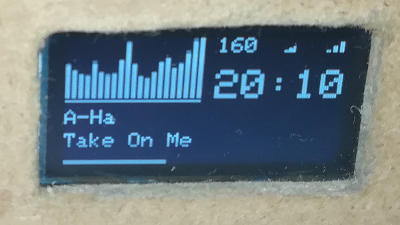

# Moode, Volumio, RuneAudio and MPD OLED Spectrum Display for Raspberry Pi

This is a development version of
[mpd_oled](https://github.com/antiprism/mpd_oled).
that uses the U8G2 library for OLED drivers and graphics.
It includes support for new displays and screen resolutions.

The mpd_oled program displays an information screen including a music
frequency spectrum on an OLED screen connected to a Raspberry Pi (or similar)
running MPD, this includes Moode, Volumio and rAudio (RuneAudio fork). The
full list of supported OLEDs is included below


## Install

A binary installation package is provided for Moode and Volumio,
and is the quickest and easiest way to install mpd_oled on this system.
All other systems should install from source code (Note: the build
commands take a long time to run on a Pi Zero).

### Moode

* [Install mpd_oled binary package on Moode 7](doc/install_moode7_deb.md)
* [Install mpd_oled from source on Moode 7](doc/install_moode7_source.md)

### Volumio

* [Install mpd_oled binary package on Volumio 2](doc/install_volumio2_deb.md)
* [Install mpd_oled from source on Volumio 2](doc/install_volumio2_source.md)

### rAudio

* [Install mpd_oled from source on rAudio 1](doc/install_raudio1.md)

### Other OS

* Debian-based OS running MPD: follow the instructions to
  [Install mpd_oled from source on Moode 7](doc/install_moode7_source.md)
  but configure a copy of the audio by editing /etc/mpd.conf directly and
  appending the contents of `/usr/local/share/mp_oled/mpd_oled_fifo.conf`.
* Arch-based OS running MPD: follow the instructions to
  [Install mpd_oled from source on rAudio 1](doc/install_raudio1_source.md)
  but configure a copy of the audio by editing /etc/mpd.conf directly and
  appending the contents of `/usr/local/share/mp_oled/mpd_oled_fifo.conf`.


## Program Help and Options

The following text is printed by running `mpd_oled -h`
```
Usage: mpd_oled -o oled_config [options] [input_file]

Display information about an MPD-based player on an OLED screen

Options
  -h,--help this help message
  --version version information

  -o <conf>  OLED configuration in form
                CONTROLLER,MODEL,PROTOCOL[,opt1=val1,opt2=val2,...]
             ('-o help' will print all supported OLEDs and their
             configuration options)
  -b <num>   number of bars to display (default: 16)
  -g <sz>    gap between bars in, pixels (default: 1)
  -f <hz>    framerate in Hz (default: 15)
  -s <vals>  scroll rate (pixels per second) and start delay (seconds), up
             to four comma separated decimal values (default: 8.0,5.0) as:
                rate_all
                rate_all,delay_all
                rate_title,delay_all,rate_artist
                rate_title,delay_title,rate_artist,delay_artist
  -C <fmt>   clock format: 0 - 24h leading 0 (default), 1 - 24h no leading 0,
                2 - 24h leading 0, 3 - 24h no leading 0
  -d         use USA date format MM-DD-YYYY (default: DD-MM-YYYY)
  -P <val>   pause screen type: p - play (default), s - stop
  -k         cava executable name is cava (default: mpd_oled_cava)
  -c         cava input method and source (default: 'fifo,/tmp/mpd_oled_fifo')
             e.g. 'fifo,/tmp/my_fifo', 'alsa,hw:5,0', 'pulse'
  -I <val>   invert black/white: n - normal (default), i - invert,
             number - switch between n and i with this period (hours), which
             may help avoid screen burn
  -p <plyr>  Player: mpd, moode, volumio, runeaudio (default: detected)
```

### OLED configuration with option -o

```
CONTROLLER SETUP DETAILS

  PROTOCOL KEY
    I2C                    - I2C (alias of HW_I2C), HW_I2C, SW_I2C
    SPI (4 wire SPI)       - SPI (alias of 4W_HW_SPI), 4W_HW_SPI, 4W_SW_SPI
    3W_SW_SPI (3 wire SPI) - 3W_SW_SPI
    8080                   - 8080

  CONTROLLER     MODEL               PROTOCOLS
  ----------     -----               ---------

  HX1230         96X68               SPI,3W_SW_SPI

  IL3820         296X128             SPI,3W_SW_SPI
                 V2_296X128          SPI,3W_SW_SPI

  IST3020        ERC19264            SPI,8080

  IST7920        128X128             SPI,8080

  LD7032         60X32               I2C,SPI
                 60X32_ALT           I2C,SPI

  LS013B7DH03    128X128             SPI

  LS013B7DH05    144X168             SPI

  LS027B7DH01    400X240             SPI
                 M0_400X240          SPI

  MAX7219        32X8                SPI
                 64X8                SPI
                 8X8                 SPI

  NT7534         TG12864R            SPI,8080

  PCD8544        84X48               SPI,3W_SW_SPI

  PCF8812        96X65               SPI,3W_SW_SPI

  RA8835         320X240             8080
                 NHD_240X128         8080

  S1D15721       240X64              SPI,8080

  S1D15E06       160100              SPI,8080

  SED1330        240X128             8080

  SH1106         128X32              I2C,SPI,3W_SW_SPI,8080
                 128X32_VISIONOX     I2C,SPI,3W_SW_SPI,8080
                 128X64              I2C,SPI,3W_SW_SPI,8080
                 128X64_NONAME       I2C,SPI,3W_SW_SPI,8080
                 128X64_VCOMH0       I2C,SPI,3W_SW_SPI,8080
                 128X64_WINSTAR      I2C,SPI,3W_SW_SPI,8080
                 64X32               I2C,SPI,3W_SW_SPI,8080
                 72X40_WISE          I2C,SPI,3W_SW_SPI,8080

  SH1107         128X128             I2C,SPI,3W_SW_SPI,8080
                 64X128              I2C,SPI,3W_SW_SPI,8080
                 PIMORONI_128X128    I2C,SPI,3W_SW_SPI,8080
                 SEEED_128X128       I2C,SPI,3W_SW_SPI,8080
                 SEEED_96X96         I2C,SPI,3W_SW_SPI,8080

  SH1108         160X160             I2C,SPI,3W_SW_SPI,8080

  SH1122         256X64              I2C,SPI,3W_SW_SPI,8080

  SSD0323        OS128064            I2C,SPI,3W_SW_SPI,8080

  SSD1305        128X32              I2C,SPI,8080
                 128X32_ADAFRUIT     I2C,SPI,8080
                 128X32_NONAME       I2C,SPI,8080
                 128X64_ADAFRUIT     I2C,SPI,8080
                 128X64_RAYSTAR      I2C,SPI,8080

  SSD1306        128X32_UNIVISION    I2C,SPI,3W_SW_SPI,8080
                 128X32_WINSTAR      I2C,SPI,3W_SW_SPI,8080
                 128X64              I2C,SPI,3W_SW_SPI,8080
                 128X64_ALT0         I2C,SPI,3W_SW_SPI,8080
                 128X64_NONAME       I2C,SPI,3W_SW_SPI,8080
                 128X64_VCOMH0       I2C,SPI,3W_SW_SPI,8080
                 2040X16             SPI,3W_SW_SPI,8080
                 48X64_WINSTAR       I2C,SPI,3W_SW_SPI,8080
                 64X32               I2C,SPI,3W_SW_SPI,8080
                 64X32_1F            I2C,SPI,3W_SW_SPI,8080
                 64X32_NONAME        I2C,SPI,3W_SW_SPI,8080
                 64X48_ER            I2C,SPI,3W_SW_SPI,8080
                 72X40_ER            I2C,SPI,3W_SW_SPI,8080
                 96X16_ER            I2C,SPI,3W_SW_SPI,8080

  SSD1309        128X64              I2C,SPI,8080
                 128X64_NONAME0      I2C,SPI,8080
                 128X64_NONAME2      I2C,SPI,8080

  SSD1316        128X32              I2C,SPI,8080

  SSD1317        96X96               I2C,SPI,8080

  SSD1318        128X96              I2C,SPI,3W_SW_SPI,8080
                 128X96_XCP          I2C,SPI,3W_SW_SPI,8080

  SSD1320        160X132             SPI,3W_SW_SPI,8080
                 160X32              SPI,3W_SW_SPI,8080

  SSD1322        NHD_128X64          SPI,3W_SW_SPI,8080
                 NHD_256X64          SPI,3W_SW_SPI,8080

  SSD1325        NHD_128X64          I2C,SPI,3W_SW_SPI,8080

  SSD1326        ER_256X32           I2C,SPI,3W_SW_SPI,8080

  SSD1327        EA_W128128          I2C,SPI,3W_SW_SPI,8080
                 MIDAS_128X128       I2C,SPI,3W_SW_SPI,8080
                 SEEED_96X96         I2C,SPI,3W_SW_SPI,8080
                 VISIONOX_128X96     I2C,SPI,3W_SW_SPI,8080
                 WS_128X128          I2C,SPI,3W_SW_SPI,8080
                 WS_96X64            I2C,SPI,3W_SW_SPI,8080

  SSD1329        128X96              SPI,8080
                 128X96_NONAME       SPI,8080

  SSD1606        172X72              SPI,3W_SW_SPI

  SSD1607        200X200             SPI,3W_SW_SPI
                 GD_200X200          SPI,3W_SW_SPI
                 WS_200X200          SPI,3W_SW_SPI

  ST7511         AVD_320X240         SPI,3W_SW_SPI,8080

  ST75256        JLX172104           I2C,SPI,3W_SW_SPI,8080
                 JLX19296            I2C,SPI,3W_SW_SPI,8080
                 JLX240160           I2C,SPI,3W_SW_SPI,8080
                 JLX256128           I2C,SPI,3W_SW_SPI,8080
                 JLX256160           I2C,SPI,3W_SW_SPI,8080
                 JLX256160M          I2C,SPI,3W_SW_SPI,8080
                 JLX256160_ALT       I2C,SPI,3W_SW_SPI,8080
                 JLX25664            I2C,SPI,3W_SW_SPI,8080
                 WO256X128           I2C,SPI,3W_SW_SPI,8080

  ST7528         ERC16064            I2C,SPI,8080
                 NHD_C160100         I2C,SPI,8080

  ST75320        JLX320240           I2C,SPI,3W_SW_SPI,8080

  ST7565         64128N              SPI,3W_SW_SPI,8080
                 EA_DOGM128          SPI,3W_SW_SPI,8080
                 EA_DOGM132          SPI,3W_SW_SPI,8080
                 ERC12864            SPI,3W_SW_SPI,8080
                 ERC12864_ALT        SPI,3W_SW_SPI,8080
                 JLX12864            SPI,3W_SW_SPI,8080
                 KS0713              SPI,3W_SW_SPI,8080
                 LM6059              SPI,3W_SW_SPI,8080
                 LM6063              SPI,3W_SW_SPI,8080
                 LX12864             SPI,3W_SW_SPI,8080
                 NHD_C12832          SPI,3W_SW_SPI,8080
                 NHD_C12864          SPI,3W_SW_SPI,8080
                 ZOLEN_128X64        SPI,3W_SW_SPI,8080

  ST7567         64X32               I2C,SPI,8080
                 ENH_DG128064        SPI,8080
                 ENH_DG128064I       SPI,8080
                 HEM6432             I2C,SPI,8080
                 JLX12864            SPI,8080
                 OS12864             SPI,8080
                 PI_132X64           SPI,8080

  ST7571         128X128             I2C,SPI,8080

  ST7586S        ERC240160           SPI,3W_SW_SPI,8080
                 S028HN118A          SPI
                 YMC240160           SPI,3W_SW_SPI,8080

  ST7588         JLX12864            I2C,SPI,3W_SW_SPI,8080

  ST7920         128X64              8080
                 192X32              8080

  T6963          128X64              8080
                 128X64_ALT          8080
                 160X80              8080
                 240X128             8080
                 240X64              8080
                 256X64              8080

  UC1601         128X32              I2C,SPI,3W_SW_SPI,8080
                 128X64              I2C,SPI,3W_SW_SPI,8080

  UC1604         JLX19264            I2C,SPI,3W_SW_SPI,8080

  UC1608         240X128             I2C,SPI,3W_SW_SPI,8080
                 DEM240064           I2C,SPI,3W_SW_SPI,8080
                 ERC240120           I2C,SPI,3W_SW_SPI,8080
                 ERC24064            I2C,SPI,3W_SW_SPI,8080

  UC1610         EA_DOGXL160         I2C,SPI,3W_SW_SPI,8080

  UC1611         CG160160            I2C,SPI,3W_SW_SPI,8080
                 EA_DOGM240          I2C,SPI,3W_SW_SPI,8080
                 EA_DOGXL240         I2C,SPI,3W_SW_SPI,8080
                 EW50850             I2C,SPI,3W_SW_SPI,8080
                 IDS4073             I2C,SPI,3W_SW_SPI,8080

  UC1617         JLX128128           I2C,SPI,3W_SW_SPI

  UC1638         160X128             SPI,3W_SW_SPI,8080

  UC1701         EA_DOGS102          SPI,3W_SW_SPI,8080
                 MINI12864           SPI,3W_SW_SPI,8080

PROTOCOL OPTIONS

  I2C is an alias for HW_I2C, SPI is an alias for 4W_HW_SPI
    HW_I2C - hardware I2C
      required: 
      optional: rotation,clock,data,reset,i2c_address,bus_number
    SW_I2C - software I2C
      required: clock,data
      optional: rotation,reset,i2c_address
    4W_HW_SPI - 4 wire hardware SPI
      required: dc
      optional: rotation,reset,bus_number,cs_number
    4W_SW_SPI - 4 wire software SPI
      required: clock,data,cs,dc
      optional: rotation,reset
    3W_SW_SPI - 3 wire software SPI
      required: clock,data,cs
      optional: rotation,reset
    8080 - 8080
      required: clock,data,d0,d1,d2,d3,d4,d5,d6,d7,wr
      optional: rotation,reset

PROTOCOL OPTION DESCRIPTIONS

  rotation        - rotation (0: 0 degs, 1: 90 degs, 2: 180 degs, 3: 270 degs)
  clock           - clock pin (GPIO number)
  data            - data pin (GPIO number)
  cs              - CS pin (GPIO number)
  dc              - DC pin (GPIO number)
  reset           - reset pin (GPIO number)
  d0              - D0 pin (GPIO number)
  d1              - D1 pin (GPIO number)
  d2              - D2 pin (GPIO number)
  d3              - D3 pin (GPIO number)
  d4              - D4 pin (GPIO number)
  d5              - D5 pin (GPIO number)
  d6              - D6 pin (GPIO number)
  d7              - D7 pin (GPIO number)
  wr              - WR pin (GPIO number)
  i2c_address     - I2C address (hex 01-fe)
  bus_number      - bus number
  cs_number       - CS number

```

## Credits

U8G2 OLED library: <https://github.com/olikraus/u8g2>
C.A.V.A. bar spectrum audio visualizer: <https://github.com/karlstav/cava>
Hjson for C++: <https://github.com/hjson/hjson-cpp>
HTTP tiny library: <https://github.com/ldemailly/http-tiny>
Libmpdclient: <https://www.musicpd.org/libs/libmpdclient/>
